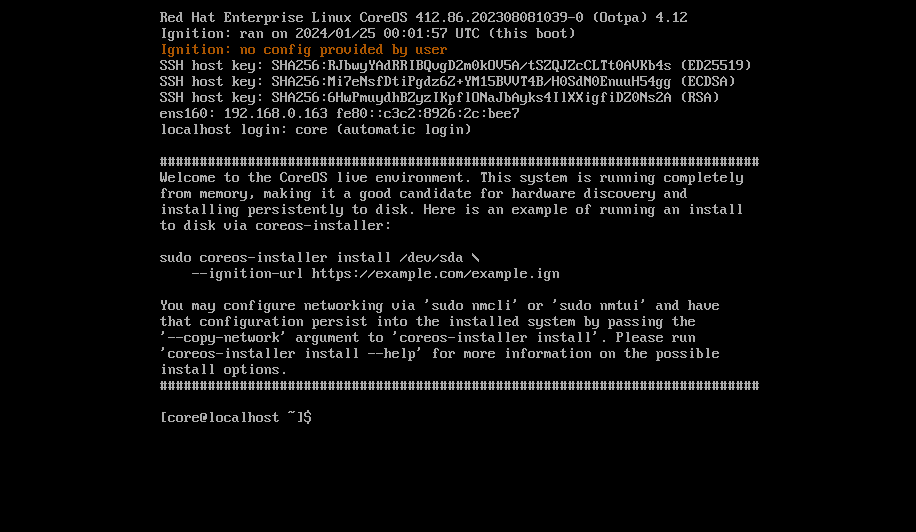
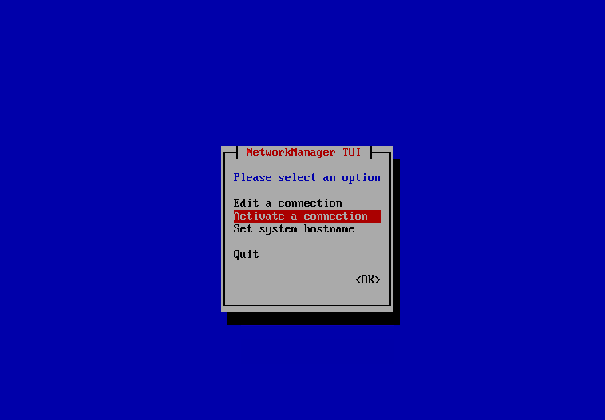
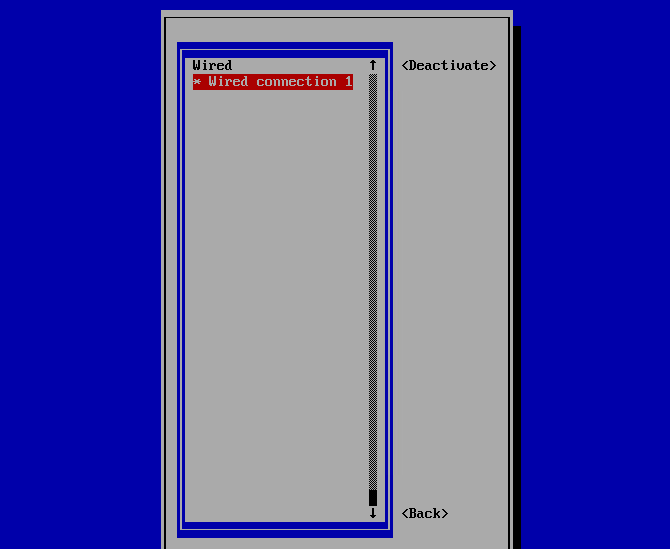
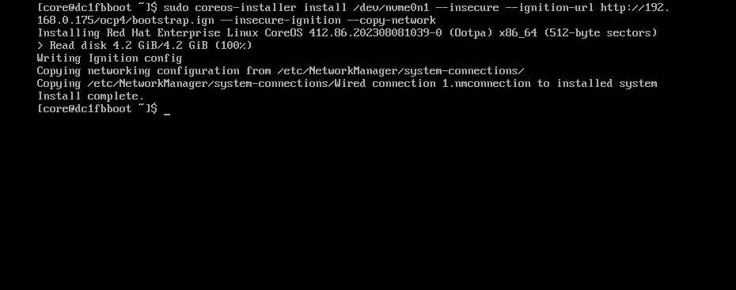
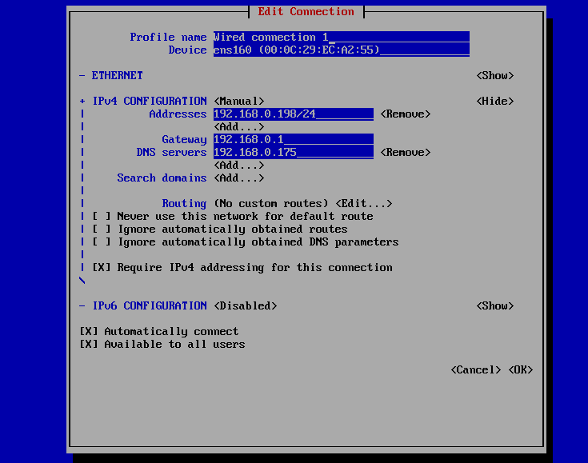
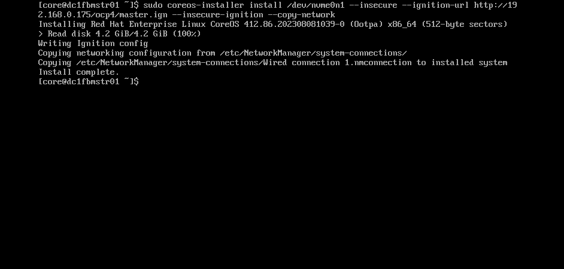

## 3. Installing a OpenShift Cluster in a Disconnected Network on Baremetal Machines

3.1. Installing a OpenShift Cluster Setup.

Generating an SSH private key and adding it to the agent

    [root@halloween ~]# ssh-keygen -t ed25519 -N ''
    Generating public/private ed25519 key pair.
    Enter file in which to save the key (/root/.ssh/id_ed25519):
    Created directory '/root/.ssh'.
    Your identification has been saved in /root/.ssh/id_ed25519.
    Your public key has been saved in /root/.ssh/id_ed25519.pub.
    The key fingerprint is:
    SHA256:z3mXx9Pe/hPC6dCkVtQB3NOc05NqoxTVnysV+OSAD6I root@halloween.ocp4.example.com
    The key's randomart image is:
    +--[ED25519 256]--+
    |            +o*o*|
    |         . + = %+|
    |        . . = * B|
    |       E   . B =.|
    |        S . O + .|
    |         o * * =.|
    |          = + =.=|
    |           . o +o|
    |               .B|
    +----[SHA256]-----+
    
    [root@halloween ~]# cat .ssh/id_ed25519.pub 
    ssh-ed25519 AAAAC3NzaC1{<REDACTED>}DIUeZJkdjTaMRkzn root@halloween.ocp4.example.com
    
Manually creating the installation configuration file

    [root@halloween ocp4]# cat install-config.yaml 
    apiVersion: v1
    baseDomain: example.com
    compute:
    - hyperthreading: Enabled
      name: worker 
      replicas: 0 
    controlPlane:
    	hyperthreading: Enabled
    	name: master
    	replicas: 1
    metadata:
    	name: ocp4
    networking:
    	clusterNetwork:
        - cidr: 10.128.0.0/14
        	hostPrefix: 23
      networkType: OVNKubernetes
      serviceNetwork:
        - 172.30.0.0/16
    platform:
    	none: {}
    fips: false
    pullSecret: '{"auths":{"cloud.openshift.com":{"auth":"b3BlbnNoaWZ0LXJlbGVhc2UtZGV2K29jbV9hY2Nlc3NfN2FjZjg5OWQ3YWQ1NDVlNWFhZjhiZDZkNmU3M2I2MjE6U0g5RlFXUVhBT1lURkRBODdBQ1RMWjdFMDI5UVBDTUJSWENPMExNVFlIUVlMRkpDU043Skw2SE1XSE5aTFBTRw==","email":"sanuragi@redhat.com"},"quay.io":{"auth":"b3BlbnNoaWZ0LXJlbGVhc2UtZGV2K29jbV9hY2Nlc3NfN2FjZjg5OWQ3YWQ1NDVlNWFhZjhiZDZkNmU3M2I2MjE6U0g5RlFXUVhBT1lURkRBODdBQ1RMWjdFMDI5UVBDTUJSWENPMExNVFlIUVlMRkpDU043Skw2SE1XSE5aTFBTRw==","email":"sanuragi@redhat.com"},"registry.connect.redhat.com":{"auth":"fHVoYy1wb29sLTkyMjQ1ODk2LTc1MWMtNDdhYi04ZWY0LTVhYjc4NDAyMzNmOTpleUpoYkdjaU9pSlNVelV4TWlKOS5leUp6ZFdJaU9pSXhNbVUwWkRVek1HTmxZVE0wTnpneFlUUTROREprWVRRM056Sm1NMlExWmlKOS5ZTlM5SXJXX2pUa2tZWjQ0c0tvUVdwbVRyQW8wMmM4TXVPRjVaTWppakpZUXpVSWE0ZDFmUHBGajVBakVFbjZ0dkcyZWIwcmppMnVhWDBYSmFfeTVMNVk4RUFNTzEwb3l3LXE2VFYyX1h5dVdELTZxZzBOUVI3M0YwWkp1NXlHUmQ4dEt2dktMeEVNOEY1Ql8zajY0M2FJeTJzdWJQVXJmQ0pUWnMtWHV4MXdYLVFwZ3laa3BrN182Qi1EUUpNMS1xTThRYjlucjFhVzRUakVzakVWS3FaZ1VjTkxadTh5QlZaOVU3cWFCQ3dyZy1iR0pPNlJ5czd3UFlXOUtxSzVsV0RNeFppNlRWME1YTlgzU0RkWW0zcTJZZ3lEUlhTeWZWVXVmNHJ0cU9PZTJ2MEpTN2lTdmgxc1Z4bkp6MDkzTmlndmIzazZpUElFUzVQdUoyVDE0UWNWRFozREhDc21IQ0RPU0pmTElNYVlXRmVtaDJWc1RXa2Zucm5xRGJqZWZ0LXRGU0lyT0ZpNTNrWG02RVZEWFA2RWZUcWxyOTJlUDlUMVRFTE5oanBfT1RXcUdUYjB4M0dkMllaWWNETU1EM1ZtSzhEYW9xX0VCQ2EzdWxjdU5xVlphcWdGMUlRdl9nNENlZWIxZFBXSzIzVlNReEVoOE1kYVZ6emRoMjJFU2s3MzRNcDBqeXJYZHFaRVpOWUtSM29XNHdnN3BIZ21sNXd4LXJxc0hXbEtIRUgzMWJ3RVlBUmZyT2otQUJqY2lLRGRIQjFENWZnNERzakRVZ2VkdDM3bVMtUjRuQWVoYktGaW4yLWItY3Q0MHdFSjZiNEFibk5QVzQxQ1lvTHNXZ3ZpbF9VenBMTEZ4akFhaFRMOWF3MXVTVXk1c3l3aExFR1VTN0xLc1VaTQ==","email":"sanuragi@redhat.com"},"registry.redhat.io":{"auth":"fHVoYy1wb29sLTkyMjQ1ODk2LTc1MWMtNDdhYi04ZWY0LTVhYjc4NDAyMzNmOTpleUpoYkdjaU9pSlNVelV4TWlKOS5leUp6ZFdJaU9pSXhNbVUwWkRVek1HTmxZVE0wTnpneFlUUTROREprWVRRM056Sm1NMlExWmlKOS5ZTlM5SXJXX2pUa2tZWjQ0c0tvUVdwbVRyQW8wMmM4TXVPRjVaTWppakpZUXpVSWE0ZDFmUHBGajVBakVFbjZ0dkcyZWIwcmppMnVhWDBYSmFfeTVMNVk4RUFNTzEwb3l3LXE2VFYyX1h5dVdELTZxZzBOUVI3M0YwWkp1NXlHUmQ4dEt2dktMeEVNOEY1Ql8zajY0M2FJeTJzdWJQVXJmQ0pUWnMtWHV4MXdYLVFwZ3laa3BrN182Qi1EUUpNMS1xTThRYjlucjFhVzRUakVzakVWS3FaZ1VjTkxadTh5QlZaOVU3cWFCQ3dyZy1iR0pPNlJ5czd3UFlXOUtxSzVsV0RNeFppNlRWME1YTlgzU0RkWW0zcTJZZ3lEUlhTeWZWVXVmNHJ0cU9PZTJ2MEpTN2lTdmgxc1Z4bkp6MDkzTmlndmIzazZpUElFUzVQdUoyVDE0UWNWRFozREhDc21IQ0RPU0pmTElNYVlXRmVtaDJWc1RXa2Zucm5xRGJqZWZ0LXRGU0lyT0ZpNTNrWG02RVZEWFA2RWZUcWxyOTJlUDlUMVRFTE5oanBfT1RXcUdUYjB4M0dkMllaWWNETU1EM1ZtSzhEYW9xX0VCQ2EzdWxjdU5xVlphcWdGMUlRdl9nNENlZWIxZFBXSzIzVlNReEVoOE1kYVZ6emRoMjJFU2s3MzRNcDBqeXJYZHFaRVpOWUtSM29XNHdnN3BIZ21sNXd4LXJxc0hXbEtIRUgzMWJ3RVlBUmZyT2otQUJqY2lLRGRIQjFENWZnNERzakRVZ2VkdDM3bVMtUjRuQWVoYktGaW4yLWItY3Q0MHdFSjZiNEFibk5QVzQxQ1lvTHNXZ3ZpbF9VenBMTEZ4akFhaFRMOWF3MXVTVXk1c3l3aExFR1VTN0xLc1VaTQ==","email":"sanuragi@redhat.com"}}}'
    sshKey: "ssh-ed25519 AAAAC3NzaC1lZDI1NTE5AAAAIAV1pNiahN1jaRH9lCWrfi2K6n1ylyqETxazjy42d/8Q root@bastion.lab.example.com"
 

Creating the Openshift/Kubernetes manifest

    [root@halloween ~]# ./openshift-install create manifests --dir ocp4/
    INFO Consuming Install Config from target directory 
    WARNING Making control-plane schedulable by setting MastersSchedulable to true for Scheduler cluster settings 
    INFO Manifests created in: ocp4/manifests and ocp4/openshift 

Creating the Openshift/Kubernetes cluster scheduling false. 

    [root@halloween ocp4]# ls
    manifests  openshift

    [root@halloween ocp4]# cd manifests/

    [root@halloween manifests]# ls
    cluster-config.yaml                   cluster-network-01-crd.yml       cvo-overrides.yaml                  kube-system-configmap-root-ca.yaml        
    cluster-dns-02-config.yml             cluster-network-02-config.yml    Images/image-content-source-policy-0.yaml  machine-config-server-tls-secret.yaml     
    cluster-infrastructure-02-config.yml  cluster-proxy-01-config.yaml     Images/image-content-source-policy-1.yaml  openshift-config-secret-pull-secret.yaml  
    cluster-ingress-02-config.yml         cluster-scheduler-02-config.yml  kube-cloud-config.yaml              user-ca-bundle-config.yaml

    [root@halloween manifests]# vim cluster-scheduler-02-config.yml
    apiVersion: config.openshift.io/v1
    kind: Scheduler
    metadata:
      creationTimestamp: null
      name: cluster
    spec:
      mastersSchedulable: false
      policy:
        name: ""
    status: {}

Creating the Openshift/Kubernetes ignition files.

    [root@halloween ~]# ./openshift-install create ignition-configs --dir=ocp4
    INFO Consuming Openshift Manifests from target directory 
    INFO Consuming OpenShift Install (Manifests) from target directory 
    INFO Consuming Worker Machines from target directory 
    INFO Consuming Common Manifests from target directory 
    INFO Consuming Master Machines from target directory 
    INFO Ignition-Configs created in: ocp4 and ocp4/auth 

Install and Configure Apache HTTPD Server

    [root@halloween ~]# yum install httpd -y

Create new directory ocp4. 

    [root@halloween ~]# mkdir /var/www/html/ocp4 

Copying all ignition files to web directory. 

    [root@halloween ~]# cp -rf ocp4/*.ign /var/www/html/ocp4/

Changing Ownership and Permissions.

    [root@halloween ~]# chown apache:apache -R /var/www/html/ocp4/
    [root@halloween ~]# chmod 644 -R /var/www/html/ocp4/*.ign
    
    [root@halloween html]# cd /var/www/html/ocp4/
    [root@halloween ocp4]# ll
    total 284
    -rw-r--r-- 1 apache apache 280395 Jan 24 23:37 bootstrap.ign
    -rw-r--r-- 1 apache apache   1728 Jan 24 23:37 master.ign
    -rw-r--r-- 1 apache apache   1728 Jan 24 23:37 worker.ign
 
Checking output of web server. 
       
    [root@halloween ocp4]# curl http://halloween.ocp4.example.com/ocp4/
    <!DOCTYPE HTML PUBLIC "-//W3C//DTD HTML 3.2 Final//EN">
    <html>
     <head>
      <title>Index of /ocp4</title>
     </head>
     <body>
    <h1>Index of /ocp4</h1>
      <table>
       <tr><th valign="top"></th><th><a href="?C=N;O=D">Name</a></th><th><a href="?C=M;O=A">Last modified</a></th><th><a href="?C=S;O=A">Size</a></th><th><a href="?C=D;O=A">Description</a></th></tr>
       <tr><th colspan="5">
</th></tr>
    <tr><td valign="top"></td><td><a href="/">Parent Directory</a>       </td><td>&nbsp;</td><td align="right">  - </td><td>&nbsp;</td></tr>
    <tr><td valign="top"></td><td><a href="bootstrap.ign">bootstrap.ign</a>          </td><td align="right">2024-01-24 23:37  </td><td align="right">274K</td><td>&nbsp;</td></tr>
    <tr><td valign="top"></td><td><a href="master.ign">master.ign</a>             </td><td align="right">2024-01-24 23:37  </td><td align="right">1.7K</td><td>&nbsp;</td></tr>
    <tr><td valign="top"></td><td><a href="worker.ign">worker.ign</a>             </td><td align="right">2024-01-24 23:37  </td><td align="right">1.7K</td><td>&nbsp;</td></tr>
       <tr><th colspan="5">
</th></tr>
    </table>
    </body></html>

## Preparing Bootstrap Node 

Boot RHCOS Image -> Configure Networking -> Install coreos-installer -> reboot

- nmtui -> edit a connection -> ens33 -> ipv4 configuration -> gateway -> dns -> ok 

- nmtui -> activate a connection -> disable -> enable 

- coreos-installer install /dev/sda --ignition-url http://192.168.1.195/ocp4/bootstrap.ign --insecure --insecure-ignition --copy-network 

- reboot

## Preparing Masters Node 

Boot RHCOS Image -> Configure Networking -> Install coreos-installer -> reboot

- nmtui -> edit a connection -> ens33 -> ipv4 configuration -> gateway -> dns -> ok 

- nmtui -> activate a connection -> disable -> enable 

- coreos-installer install /dev/sda --ignition-url http://192.168.1.195/ocp4/bootstrap.ign --insecure --insecure-ignition --copy-network 

- reboot

## Preparing Infra Node 

Boot RHCOS Image -> Configure Networking -> Install coreos-installer -> reboot
- nmtui -> edit a connection -> ens33 -> ipv4 configuration -> gateway -> dns -> ok 
- nmtui -> activate a connection -> disable -> enable 
- coreos-installer install /dev/sda --ignition-url http://192.168.1.195/ocp4/master.ign --insecure --insecure-ignition --copy-network 
- reboot

## Preparing Worker Node

Boot RHCOS Image -> Configure Networking -> Install coreos-installer -> reboot
- nmtui -> edit a connection -> ens33 -> ipv4 configuration -> gateway -> dns -> ok 
- nmtui -> activate a connection -> disable -> enable 
- coreos-installer install /dev/sda --ignition-url http://192.168.1.195/ocp4/worker.ign --insecure --insecure-ignition --copy-network 
- reboot

# Openshift 4.12 Bootstrapping

Login to bootstrap node. 

    [root@halloween ~]# ssh core@192.168.1.197
    Warning: Permanently added '192.168.1.197' (ECDSA) to the list of known hosts.
    Red Hat Enterprise Linux CoreOS 412.86.202308081039-0
      Part of OpenShift 4.12, RHCOS is a Kubernetes native operating system
      managed by the Machine Config Operator (`clusteroperator/machine-config`).
    
    WARNING: Direct SSH access to machines is not recommended; instead,
    make configuration changes via `machineconfig` objects:
      https://docs.openshift.com/container-platform/4.12/architecture/architecture-rhcos.html
    
    ---
    This is the bootstrap node; it will be destroyed when the master is fully up.
    
    The primary services are release-image.service followed by bootkube.service. To watch their status, run e.g.
    
      journalctl -b -f -u release-image.service -u bootkube.service

    [core@boot ~]$  journalctl -b -f -u release-image.service -u bootkube.service
    -- Logs begin at Wed 2024-01-24 19:34:14 UTC. --
    Jan 24 19:34:29 boot.ocp4.example.com systemd[1]: Starting Download the OpenShift Release Image...
    Jan 24 19:34:29 boot.ocp4.example.com release-Images/image-download.sh[1904]: Pulling halloween.ocp4.example.com:8443/ocp4/openshift4@sha256:fcc9920ba10ebb02c69bdd9cd597273260eeec1b22e9ef9986a47f4874a21253...
    Jan 24 19:34:29 boot.ocp4.example.com release-Images/image-download.sh[1977]: 4be070dd54889436046224a7993fea8e507fd4658785912352688456b6359386
    Jan 24 19:34:29 boot.ocp4.example.com systemd[1]: Started Download the OpenShift Release Image.
    Jan 24 19:34:31 boot.ocp4.example.com systemd[1]: Started Bootstrap a Kubernetes cluster.

## Monitor the Bootstrap Process

You can monitor the bootstrap process from the halloween host at different log levels (debug, error, info)

    [root@halloween ~]# ~/openshift-install --dir ~/ocp4 wait-for bootstrap-complete --log-level=debug

Once bootstrapping is complete the boot.ocp4.example.com node can be removed

# Openshift Skeleton Deployment

## Wait for installation to complete

    [root@halloween ~]# ~/openshift-install --dir ~/ocp4 wait-for install-complete

Continue to join the worker nodes to the cluster in a new tab whilst waiting for the above command to complete

Setup 'oc' and 'kubectl' clients on the ocp-svc machine

    [root@halloween ~]# export KUBECONFIG=~/ocp4/auth/kubeconfig

Test auth by viewing cluster nodes

    [root@halloween ~]# oc get nodes

## View and approve pending CSRs

View CSRs

    [root@halloween ~]# oc get csr

Approve all pending CSRs

    [root@halloween ~]# oc get csr -o go-template='{{range .items}}{{if not .status}}{{.metadata.name}}{{"\n"}}{{end}}{{end}}' | xargs oc adm certificate approve

Wait for kubelet-serving CSRs and approve them too with the same command

    [root@halloween ~]# oc get csr -o go-template='{{range .items}}{{if not .status}}{{.metadata.name}}{{"\n"}}{{end}}{{end}}' | xargs oc adm certificate approve

Create Machine Config Pool for infra nodes
Move Ingress Controller components to infra nodes
Moving monitoring components from Worker to Infra labeled nodes
Deploying Openshift Internal Registry with Persistent Storage
Configure System Clock Sync with NTP Server
Configure master nodes system clock sync with NTP server

## 8. Removing the kubeadmin user

After you define an identity provider and create a new cluster-admin user, you can remove the kubeadmin to improve cluster security.

> **[!WARNING]**
> If you follow this procedure before another user is a cluster-admin, then OpenShift Container Platform must be reinstalled. It is not possible to undo this command.

### Prerequisites

* You must have configured at least one identity provider.
* You must have added the cluster-admin role to a user.
* You must be logged in as an administrator.

Retrieve the kubeadmin secret details as shown below
    
    [root@halloween ~]# oc get secrets kubeadmin -n kube-system
    NAME        TYPE     DATA   AGE
    kubeadmin   Opaque   1      97d

Remove the kubeadmin secret as shown below

    [root@halloween ~]# oc delete secrets kubeadmin -n kube-system
    secret "kubeadmin" deleted

Verify if the kubeadmin secret no more exists as shown below
    
    [root@halloween ~]# oc get secrets kubeadmin -n kube-system
    Error from server (NotFound): secrets "kubeadmin" not found
